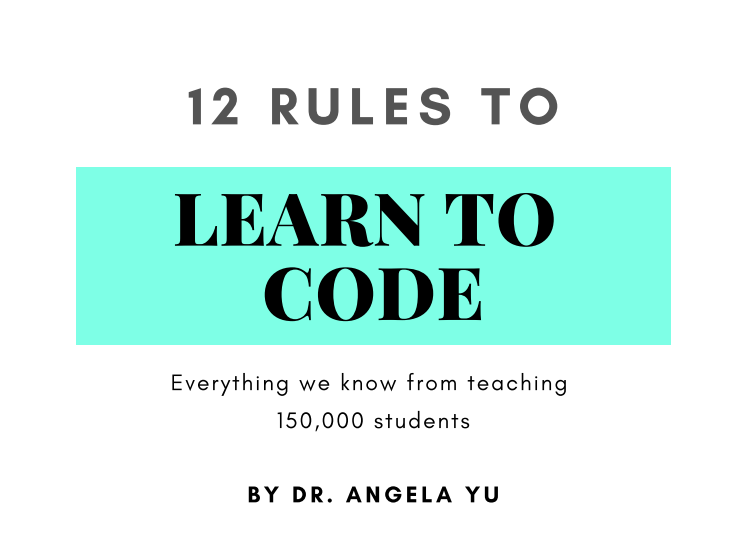

# 12rulestolearntocode

### I frequently hear questions like **"What should they learn first?"**   **Which programming language is the most important to learn?**   **Which course and tutorials are the greatest to follow?** **Is it time for me to give up programming?** and a lot more... 
 

### as well as expressions like   
**"Ughhhh, I don't understand!"** and **"I have no idea what I'm doing!"**   
_**Does it make sense to learn ( this technology )?**_
 

 **I don't think I'm getting any better at programming.**

  

## I request you to read this book, which is only of 35 pages but trust me  
**you won't ask yourself these harsh and demotivating questions.**

## Before Starting : 
Take out some time, take a bottle of a water, keep your phones away ( unless you'll be reading on it ), pause the music, grab a note and pen, start reading this. 

 

### [Download book](https://github.com/whoissubedibibek/12rulestolearntocode/raw/main/Book/12rulestolearntocode.pdf) 

## If you liked, if this helped you this make sure to share among your friends who might be struggling with same questions. ❤

@credit : 
Angela Yu 
**Appbrewery**